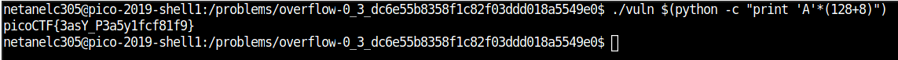

# OverFlow 0 

Points : 100

# Question

This should be easy. Overflow the correct buffer in this [program](vuln) and get a flag. Its also found in /problems/overflow-0_3_dc6e55b8358f1c82f03ddd018a5549e0 on the shell server. [Source](vuln.c).

# Hint 

Find a way to trigger the flag to printIf you try to do the math by hand, maybe try and add a few more characters.
Sometimes there are things you aren't expecting.


# Solution

By examin the source code we can see that :

``` C

#include <stdio.h>
#include <stdlib.h>
#include <string.h>
#include <signal.h>

#define FLAGSIZE_MAX 64

char flag[FLAGSIZE_MAX];

void sigsegv_handler(int sig) {
  fprintf(stderr, "%s\n", flag);
  fflush(stderr);
  exit(1);
}

void vuln(char *input){
  char buf[128];		<-------------------- We create new buffer size 128
  strcpy(buf, input);		<--------- We copy our input to the buffer using strcpy (which is vulnerable to buffer over flow)
}

int main(int argc, char **argv){
  
  FILE *f = fopen("flag.txt","r");
  if (f == NULL) {
    printf("Flag File is Missing. Problem is Misconfigured, please contact an Admin if you are running this on the shell server.\n");
    exit(0);
  }
  fgets(flag,FLAGSIZE_MAX,f);
  signal(SIGSEGV, sigsegv_handler);          <-------- If we get SIGSEGV then we jump to sigsegv_handler which print the flag
  
  gid_t gid = getegid();
  setresgid(gid, gid, gid);
  
  if (argc > 1) {                              <------ if our input is > 1 then we call vuln function 
    vuln(argv[1]);
    printf("You entered: %s", argv[1]);
  }
  else
    printf("Please enter an argument next time\n");
  return 0;
}

```

basically if we mange to cause a SIGSEGV we will get the flag .

since our buffer is 128 and we have another 4 bytes of EBP and just then we will start to overrride the return address , we need to overflow with at least (128+4+1) bytes.

```./vuln $(python -c "print 'A'*(BUFFER+EBP_SIZE+1 OR MORE)")```




# Flag
picoCTF{3asY_P3a5y1fcf81f9}

