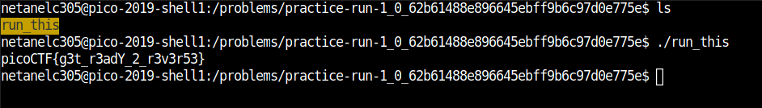

# practice-run-1

Points : 50

# Question

You're going to need to know how to run programs if you're going to get out of here. Navigate to /problems/practice-run-1_0_62b61488e896645ebff9b6c97d0e775e on the shell server and [run this](run_this) program to receive a flag.

# Hint 

How do you execute a program in a command line?

# Solution

Only need to run the program to get the flag 

# Flag
picoCTF{g3t_r3adY_2_r3v3r53}

