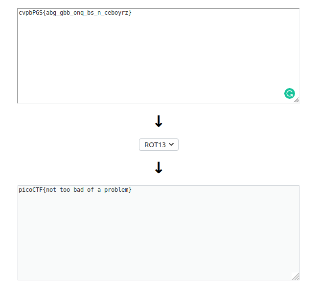

# 13

Points : 100

# Question

Cryptography can be easy, do you know what ROT13 is? cvpbPGS{abg_gbb_onq_bs_n_ceboyrz}

# Hint 

This can be solved online if you don't want to do it by hand!

# Solution

[ROT 13](https://en.wikipedia.org/wiki/ROT13) is a substitution cipher , we can use [online tool](https://rot13.com/)

to decipher the message

# Flag
picoCTF{not_too_bad_of_a_problem}

