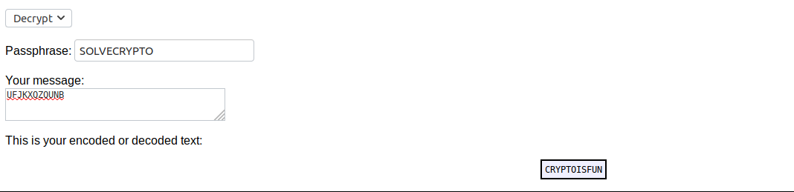

# Easy1

Points : 

# Question

The one time pad can be cryptographically secure, but not when you know the key. Can you solve this? We've given you the encrypted flag, key, and a table to help ```UFJKXQZQUNB``` with the key of ```SOLVECRYPTO``. Can you use this [table](table.txt) to solve it?. 

# Hint 

Submit your answer in our competition's flag format. For example, if you answer was 'hello', you would submit 'picoCTF{HELLO}' as the flag.
Please use all caps for the message.


# Solution

after i saw the table i right away figured its [Vigenère cipher](https://en.wikipedia.org/wiki/Vigen%C3%A8re_cipher)

i used [online tool](http://rumkin.com/tools/cipher/vigenere.php) to decipher the message 




# Flag
picoCTF{vigenere.png}

