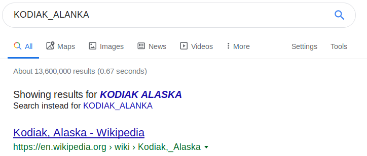

# Mr-Worldwide 

Points : 

# Question

A musician left us a [message](message.txt). What's it mean?

# Solution

look like the message is coordinates ...so I used google maps to see if I can find something that will lead me to the flag...
first, i wrote down all the cities instead of the coordinates 

```
picoCTF{(Kyoto)(Odessa)(Dayton)(İstanbul)(Abu Dhabi)(Kuala Lumpur)_(Addis Ababa)(Loja)(Amsterdam)(New York)(Kodiak)(Alexandria)}
```

however, it's still doesn't look like our flag ... so I tried to take the first letter from each city 

```
picoCTF{KODIAK_ALANKA}
```

its look like the real flag, however, it doesn't accept the solution 
let's try to google this ....




and this is the real flag :)

# Flag
picoCTF{KODIAK_ALASKA}

