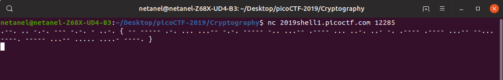
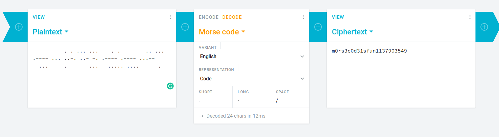

# Tapping

Points : 200

# Question

Theres tapping coming in from the wires. What's it saying nc 2019shell1.picoctf.com 12285.

# Hint 

What kind of encoding uses dashes and dots?
The flag is in the format PICOCTF{}

# Solution

After connecting using nc we get this output 

hmmmm.....morse code ?

# Flag
PICOCTF{m0rs3c0d31sfun1137903549}

