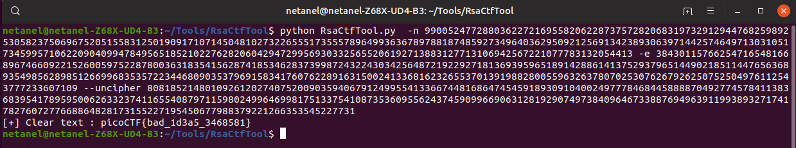

# b00tl3gRSA2

Points : 400

# Question

In RSA d is alot bigger than e, why dont we use d to encrypt instead of e? Connect with nc 2019shell1.picoctf.com 25894.

# Hint 

What is e generally?

# Solution

After connecting using nc we get this message we need to decipher 

exactly like miniRSA we can use [RsaCtfTool](https://github.com/Ganapati/RsaCtfTool)

# Flag
picoCTF{bad_1dea5_3468581}

