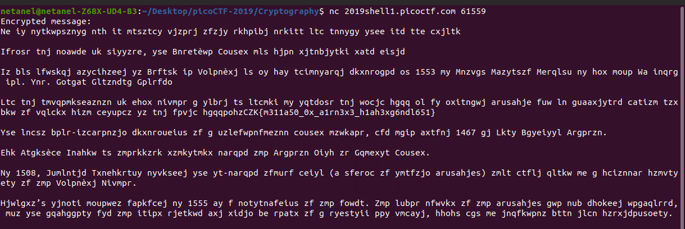
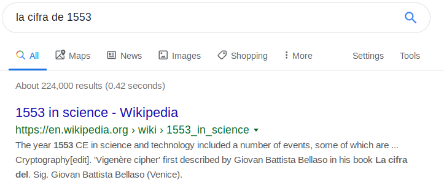
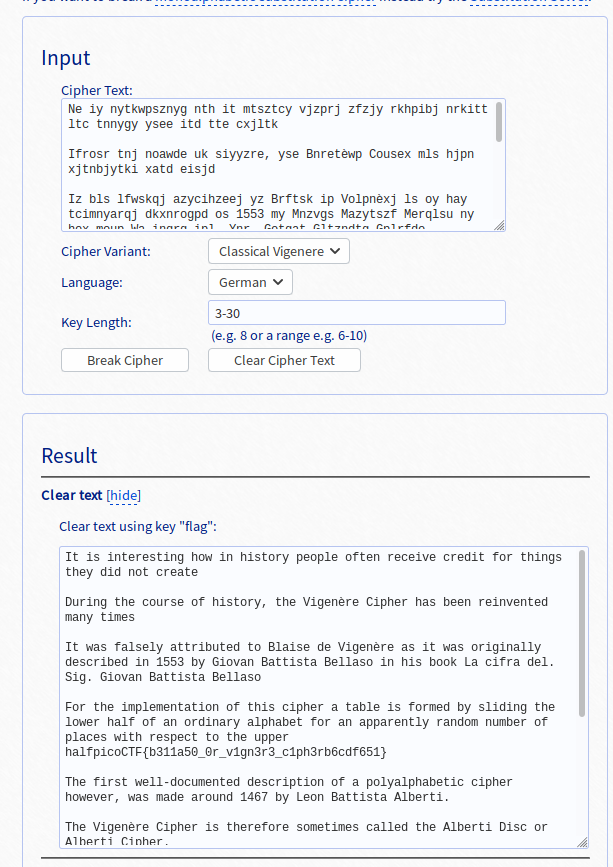

# la cifra de 

Points : 200

# Question

I found this cipher in an old book. Can you figure out what it says? Connect with nc 2019shell1.picoctf.com 61559

# Hint 

There are tools that make this easy.
Perhaps looking at history will help

# Solution

After connecting using nc we get this message 

it look like some letter shift cipher, let's try to google the challenge title maybe we will get more info 

hmmmmm Vigenere cipher again ?? but we have no key ...
so i used this [vigenere-solver](https://www.guballa.de/vigenere-solver)

# Flag
picoCTF{b311a50_0r_v1gn3r3_c1ph3rb6cdf651}

