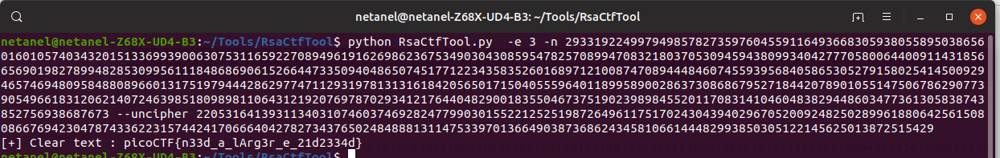

# miniRSA

Points : 300

# Question

Lets decrypt this: [ciphertext](ciphertext.txt)? Something seems a bit small

# Hint 

How could having too small an e affect the security of this 2048 bit key?
Make sure you dont lose precision, the numbers are pretty big (besides the e value)

# Solution

Inroder to solve this one i used an amazing tool name [RsaCtfTool](https://github.com/Ganapati/RsaCtfTool)

# Flag
picoCTF{n33d_a_lArg3r_e_21d2334d}

