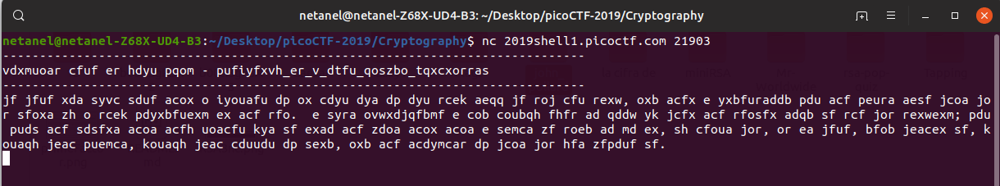
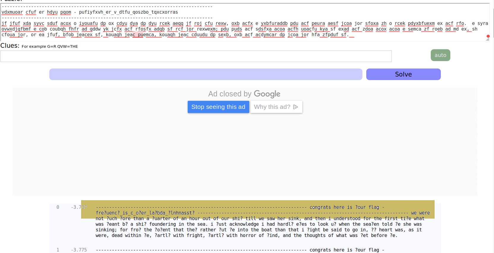
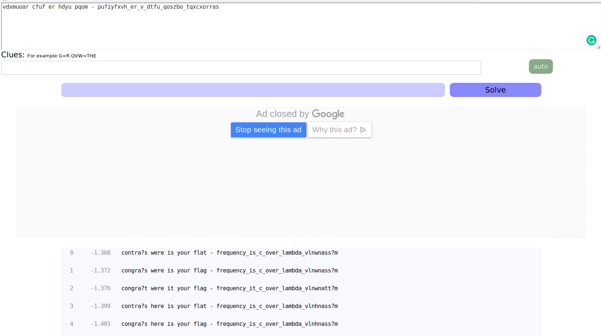

# waves over lambda 

Points : 300

# Question

We made alot of substitutions to encrypt this. Can you decrypt it? Connect with nc 2019shell1.picoctf.com 21903.

# Hint 

Flag is not in the usual flag format

# Solution

After connecting using nc we get this message




its look super messy and lot of letters substitutions, so I decided to use [quip quip](https://www.quipqiup.com/) maybe i will see something that will lead me to the flag ....



looks like i am on the right diraction ....maybe i should try to drop only ```vdxmuoar cfuf er hdyu pqom - pufiyfxvh_er_v_dtfu_qoszbo_tqxcxorras``` as input 



that's even look better however we need to get rid of the "?" 

``` congra?s were is your flag - frequency_is_c_over_lambda_vlnhnass?m```

look like the first word need to be "congrats" ....let's try to subtitue (?) with (t) 

and this is the flag ! 

# Flag
frequency_is_c_over_lambda_vlnhnasstm

