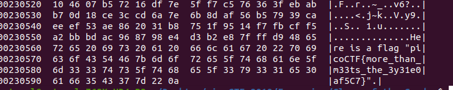

# Glory of the Garden

Points : 50

# Question

This [garden](garden.jpg) contains more than it seems. You can also find the file in /problems/glory-of-the-garden_2_258af8e13bd7259207af0b0ee6fab645 on the shell server.

# Hint 

What is a hex editor?

# Solution

Only need to open the image using a hex editor and the flag will be at the bottom. 
so i used ```hd graden.jpg```




# Flag
picoCTF{more_than_m33ts_the_3y31e0af5C7}

