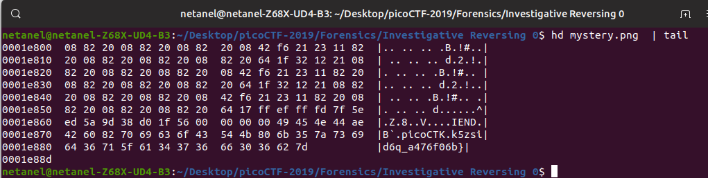

# Investigative Reversing 0

Points: 300

# Question

We have recovered a [binary](mystery) and an [image](mystery.png). See what you can make of it. There should be a flag somewhere. Its also found in /problems/investigative-reversing-0_1_6e958fc7b9c0a74ef391bf064bfa7e57 on the shell server.

# Hint 

Try using some forensics skills on the image
This problem requires both forensics and reversing skills
A hex editor may be helpful

# Solution

We get a binary file and an image, let check the image hex dump 




look like the flag was appended to the png file after the IEND chunk, however, the flag is corrupted.


now let's check the binary file with BinaryNinja and see


after looking at the assembly code we can see that every character from index 5 to 15 was modified so I wrote [script](script.py) to recover the flag.

```python
with open('mystery.png','rb') as file:
corrupt_flag=bytearray(file.read())[-26:]
flag=""
for i in range(len(corrupt_flag)):
    if 5<i<=15:
        if i ==15:
            flag+=chr(corrupt_flag[i]+3)
        else:
            flag+=chr(corrupt_flag[i]-5)
    else:
        flag+=chr(corrupt_flag[i])
print(flag)
```

 

# Flag
picoCTF{f0und_1t_a476f06b}

