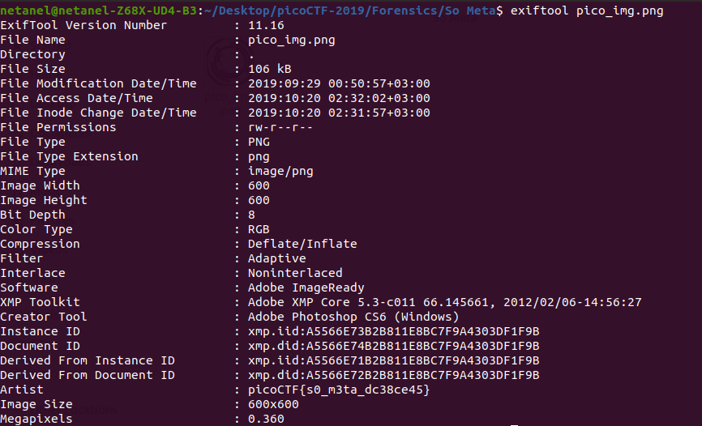

# So Meta

Points : 150	

# Question

Find the flag in this [picture](pico_img.png). You can also find the file in /problems/so-meta_0_7c0b2ae7a38b024c6b1c68cf50970a88.

# Hint 

What does meta mean in the context of files?
Ever hear of metadata?

# Solution

Only need to run ```exiftool pico_img.png``` and we get the flag under Artist field 




# Flag
picoCTF{s0_m3ta_dc38ce45}

