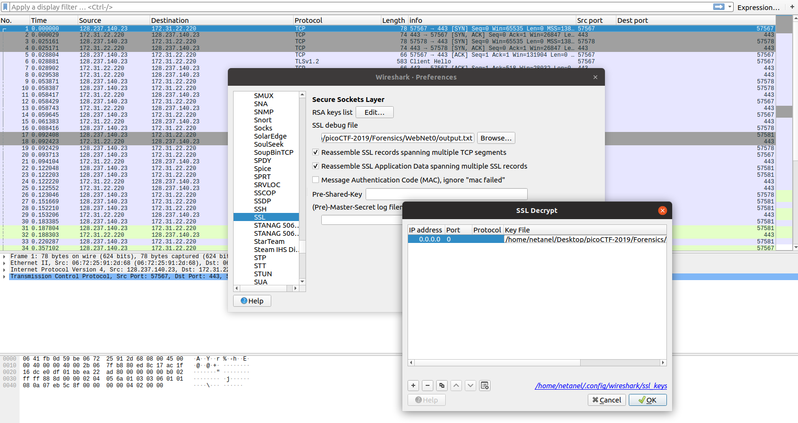
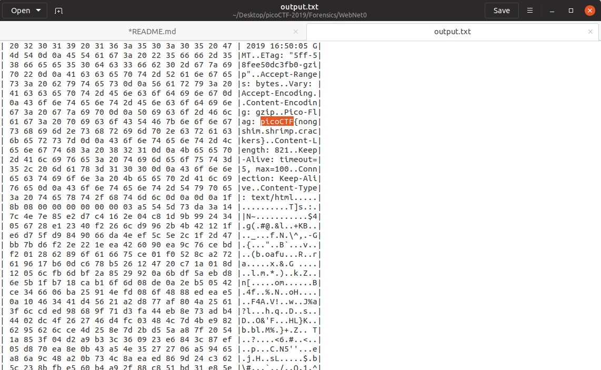

# WebNet0 

Points: 350

# Question

We found this packet [capture](capture.pcap) and [key](picopico.key). Recover the flag. You can also find the file in /problems/webnet0_0_363c0e92cf19b68e5b5c14efb37ed786.

# Hint 

Try using a tool like Wireshark
How can you decrypt the TLS stream?

# Solution

Were getting pcap with some encrypted traffic and the encryption key.

let's add the key to Wireshark and configure the path for the output file

all left to do is to search for the flag pattern in the output file 

# Flag
picoCTF{nongshim.shrimp.crackers}

