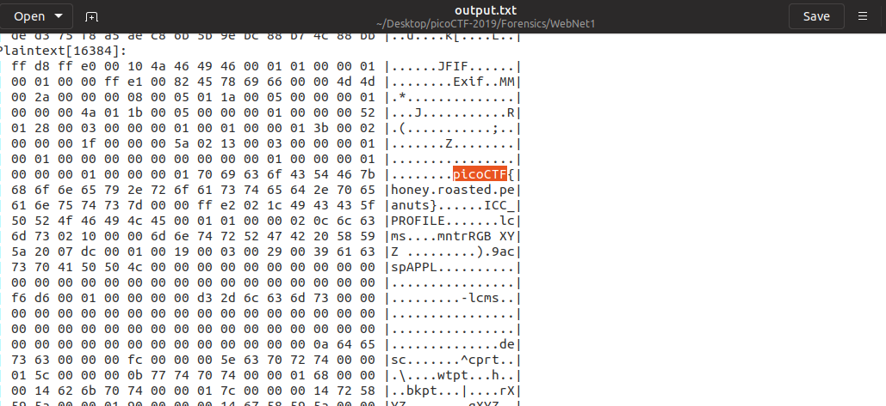

# WebNet1

Points: 450

# Question

We found this packet [capture](capture.pcap) and [key](picopico.key). Recover the flag. You can also find the file in /problems/webnet1_0_d63b267c607b8fedbae100068e010422.

# Hint 

Try using a tool like Wireshark
How can you decrypt the TLS stream?

# Solution

Exactly like we did in [WebNet0](https://github.com/netanelc305/picoCTF-2019/tree/master/Forensics/WebNet0)
we add the key to Wireshark and look inside the output file, however this time we get some fake flags and in the end, we get the real one.

# Flag
picoCTF{honey.roasted.peanuts}

