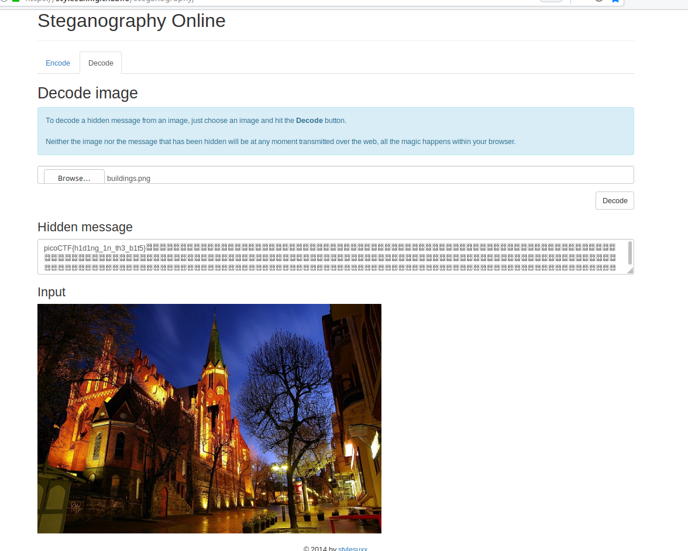

# What Lies Within

Points : 150

# Question

Theres something in the [building](buildings.png). Can you retrieve the flag?

# Hint 

There is data encoded somewhere, there might be an online decoder

# Solution

as the hint suggests I looked for online tool and found [Steganography Online](https://stylesuxx.github.io/steganography/)

# Flag
picoCTF{h1d1ng_1n_th3_b1t5}

