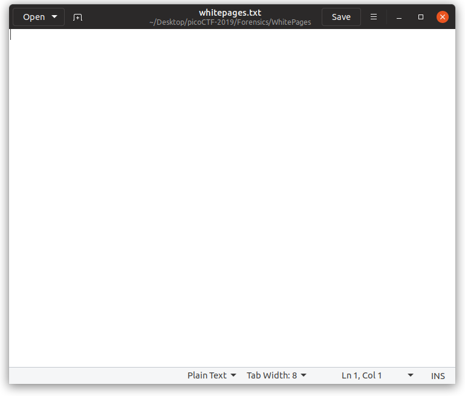
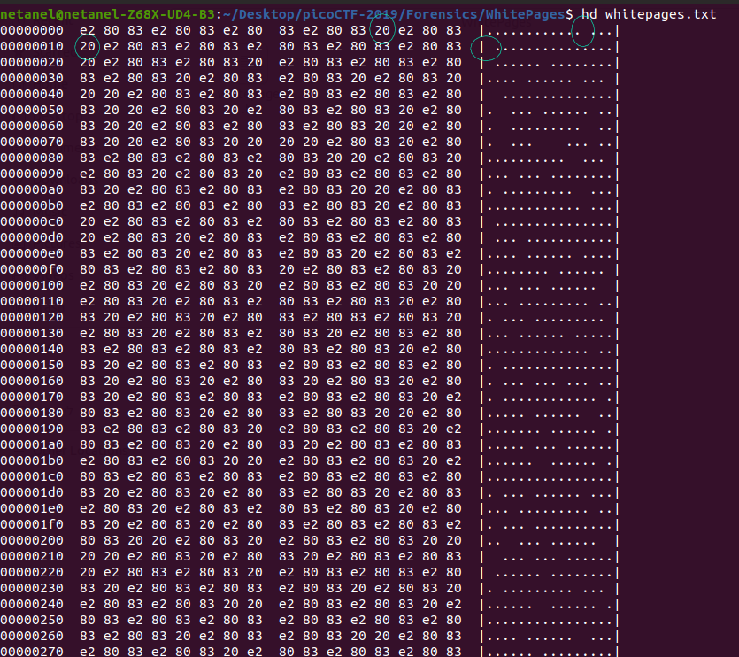
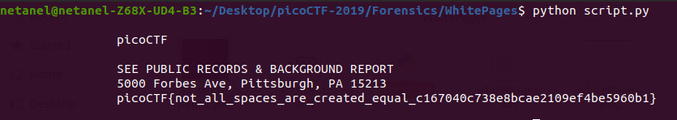

# WhitePages

Points: 250

# Question

I stopped using YellowPages and moved onto WhitePages... but [the page they gave me](whitepages.txt) is all blank!

# Solution

First, I opened the txt and it was all blank, nothing there ...



so I dropped it into hex dump maybe I can see something ...



after looking at the hex dump I figured something there is a pattern!
the byte (20) will draw space on the right table
and the bytes (e2)(80)(83) will follow this pattern and will draw a dots on the right table

so we have something that looks like representation in base 2, maybe binary?

i worte this [script](script.py) to replaced every 0x20 to 1 and (0xe2 0x80 0x83) to 0

```python

def whitePages():
    binArray=[]
    with open('whitepages.txt','rb') as file:
        arr = bytearray(file.read())
        bin = ""
        for byte in arr:
            if byte==0x20:
                bin+="1"
            elif byte==0x83:
                bin+="0"
            if len(bin)==8:
                binArray.append(bin)
                bin=""
    flag=""
    for letter in binArray:
        flag+=chr(int(letter,2))
    print(flag)


if __name__ == '__main__':
    whitePages()

```



# Flag
picoCTF{not_all_spaces_are_created_equal_c167040c738e8bcae2109ef4be5960b1}

