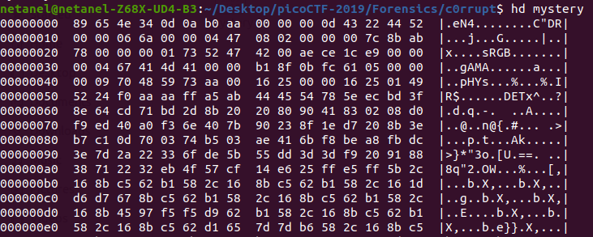
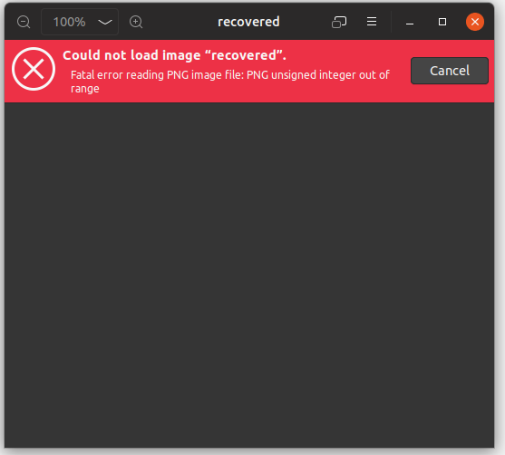
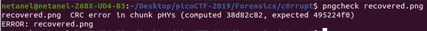
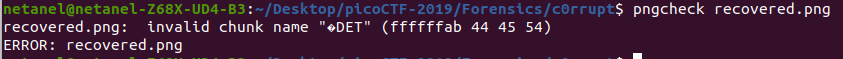

# c0rrupt 

Points : 250

# Question

We found this [file](mystery). Recover the flag. You can also find the file in /problems/c0rrupt_0_1fcad1344c25a122a00721e4af86de13.

# Hint 

Try fixing the file header

# Solution

we get some kind of binary file, when we check it using ```file``` we get its a data file.


let's check the hex dump using ```hd mystery```



when looking at the header ```89 65 4e 34 0d 0a b0 aa  00 00 00 0d 43 22 44 52``` this look like png file however the header is a bit messy 
so let's change it to PNG header ```89 50 4e 47 0d 0a 1a 0a  00 00 00 0d 49 48 44 52``` and add .png exention .



hmmm.....still not working.
After reading about [PNG  specifications](https://www.w3.org/TR/PNG/#11IHDR) I realized PNG using chunks, so maybe we have another corrupted chunks rather than the File signature and IHDR



using ```pngcheck``` we can see there is a problem with the CRC calculation in chunk PHY, we have the value 495224f0 instead 38d82c82, let's try to change it.



Ok look like we fixed the CRC however there is still a problem with the file, we have invalid chunk name and look like its suppose to be the IDAT chunk lets fix by changing ```A5 AB 44 45 54```  to ```A5 49 44 41 54```
 
finally, file recovered and we get the flag! 


# Flag
picoCTF{c0rrupt10n_1847995}

