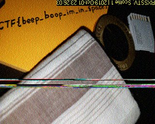

# m00nwalk

Points: 250

# Question

Decode this [message](message.wav) from the moon. You can also find the file in /problems/m00nwalk_0_05441e9344c829ba5a648e8b28ef1564.

# Hint 

How did pictures from the moon landing get sent back to Earth?
What is the CMU mascot?, that might help select a RX option

# Solution

We're getting a .wav file with some weird sounds but how we get the flag from this?

after looking "How did pictures from the moon landing get sent back to Earth?" like the hint suggest we can find [SSTV](https://en.wikipedia.org/wiki/Slow-scan_television)

so, we have audio file and we know its SSTV ...all we need is a decoder 
i used [this one](http://users.belgacom.net/hamradio/rxsstv.htm)

after decoding the .wav file we get an image with the flag 

# Flag
picoCTF{beep_boop_im_in_space}

