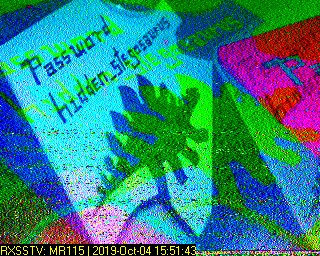
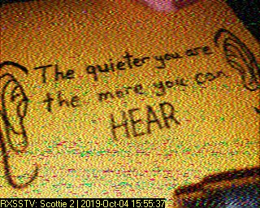
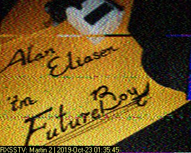
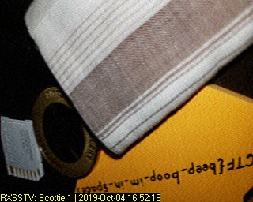
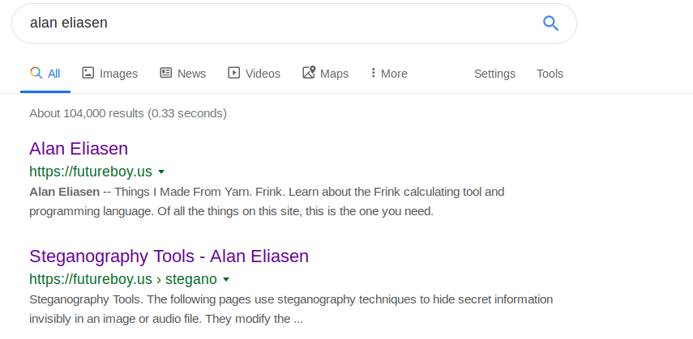
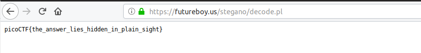

# m00nwalk2

Points: 300

# Question

Revisit the last transmission. We think this [transmission](message.wav) contains a hidden message. There are also some clues [clue 1](clue1.wav), [clue 2](clue2.wav), [clue 3](clue3.wav). You can also find the files in /problems/m00nwalk2_1_ee6747feaad7bc16aa5ca2743ecd9652.

# Hint 

Use the clues to extract the another flag from the .wav file

# Solution

Were getting hidden message and 3 clues, all of them look like SSTV images that we know from [m00walk](https://github.com/netanelc305/picoCTF-2019/tree/master/Forensics/m00nwalk)

after convert the .wav files to images this what we get :

clue1 :



clue2 :



clue3 :



message:




clue3 say ```Alan Eliasen Future boy ```, who is Alan Eliasen ?? let's ask google ..




```Steganography Tools - Alan Eliasen``` looks exactly what we need!

When we pick file to decode there is a password field and clue1 give us the password ```hidden_stegosaurus```

After clicking on decode we get the flag 




# Flag
picoCTF{the_answer_lies_hidden_in_plain_sight}

