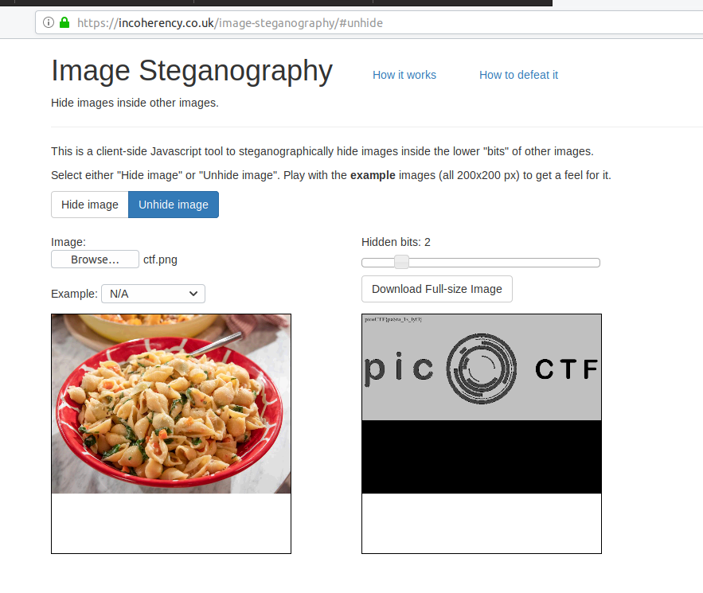
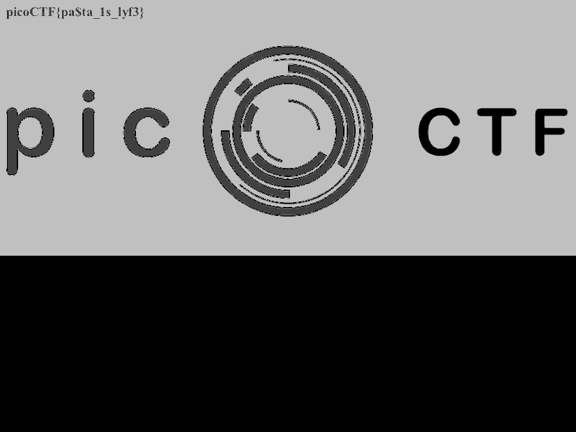

# pastaAAA

Points: 350

# Question

This [pasta](https://2019shell1.picoctf.com/static/901c4cf763d041fb03c79b31e25fd59d/ctf.png) is up to no good. There MUST be something behind it.

# Solution

we get this pasta image 

after looking for some Steganography online tools I found [this one].
Changing the bits in the image and we get the hidden image with the flag 

# Flag
picoCTF{pa$ta_1s_lyf3}

