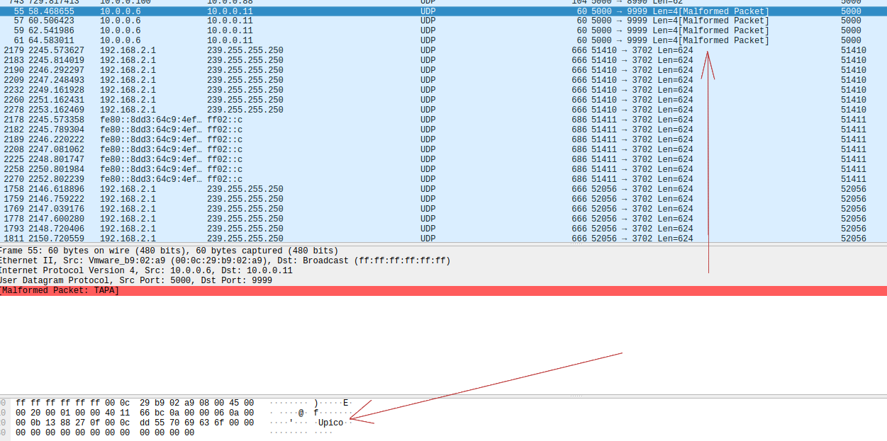
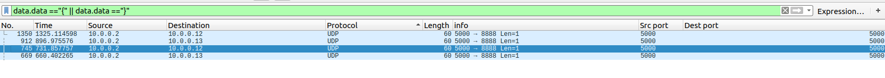
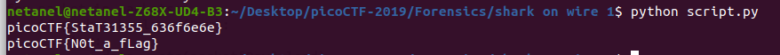

# shark on wire 1

Points: 150

# Question

We found this packet [capture](capture.pcap).
Recover the flag. You can also find the file in /problems/shark-on-wire-1_0_13d709ec13952807e477ba1b5404e620.


# Hint 

Try using a tool like Wireshark.
What are the streams?

# Solution

We get a capture with a lot of packets after scrolling a bit a "malformed packet" caught my eyes and in the data section I saw "Upico"



So, maybe it will be a good thing to check the data section of the UDP packets, as we know flag must start with "{" and end with "}", by looking this we can shrink the search



hmm, look like the source IP is always 10.0.0.2 and dest IP can be 10.0.0.12-13.

instead do this manually I wrote [script](script.py) to assemble the flag 

```python
from scapy.all import *
from scapy.layers.inet import IP, UDP

def capture_1():
    packets =rdpcap("capture.pcap")
    flag1 = ""
    flag2 = ""
    for packet in packets:
        if packet.haslayer(Raw):
            try:
                data = str(packet[Raw].load)
                ipSrc= str(packet[IP].src)
                ipDst= str(packet[IP].dst)
                if len(data)==1 and ipSrc=="10.0.0.2":
            if ipDst=="10.0.0.12":
                            flag1+=data
            elif ipDst=="10.0.0.13":
                            flag2+=data
            except:
                pass
    print(flag1)
    print(flag2)

if __name__ == '__main__':
    capture_1()
```




# Flag
picoCTF{StaT31355_636f6e6e}

