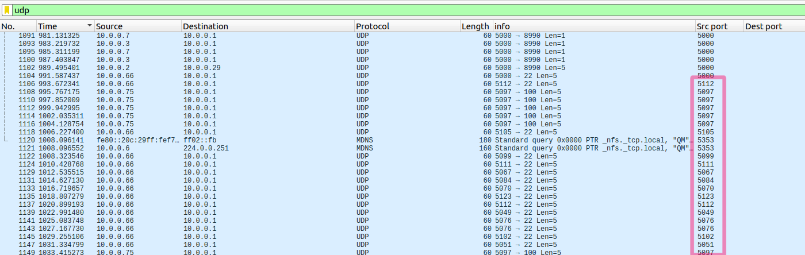
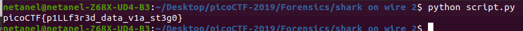

# shark on wire 2

Points: 300

# Question

We found this packet [capture](https://2019shell1.picoctf.com/static/dcd259894e0efe9d6e91da2af47e6369/capture.pcap). Recover the flag that was pilfered from the network. You can also find the file in /problems/shark-on-wire-2_0_3e92bfbdb2f6d0e25b8d019453fdbf07.

# Solution

Were getting .pcap file almost like in [shark on wire1](https://github.com/netanelc305/picoCTF-2019/tree/master/Forensics/shark%20on%20wire%201) the file even contains the real and fake flag from the previous challenge so it cause ALOT of confusion.

After analyzing the pcap and try to find a pattern I finally saw it 
at some point, the port number is changed and some letter in ASCII value is added to the original port (5000)



so i wrote a script that will extract the letter from the ports of the packet that was sent from 10.0.0.66 to 10.0.0.1

```python
from scapy.all import *
from scapy.layers.inet import IP, UDP

packets =rdpcap("capture.pcap")
flag = ""
for packet in packets:
    if packet.haslayer(Raw):
        try:
            ipSrc = str(packet[IP].src)
            ipDst = str(packet[IP].dst)
            sPort = packet[IP].sport
            if ipSrc=="10.0.0.66" and ipDst=="10.0.0.1":
                flag+=chr(sPort-5000)
        except:
            pass
print(flag)
```



# Flag
picoCTF{p1LLf3r3d_data_v1a_st3g0}

