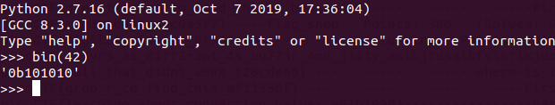

# 2Warm

Points : 50

# Question
```Can you convert the number 42 (base 10) to binary (base 2)? ```

# Hint 
```Submit your answer in our competition's flag format. For example, if you answer was '11111', you would submit 'picoCTF{11111}' as the flag.```

# Solution
Only need to covert bases , we can use python:


# Flag
picoCTF{101010}
