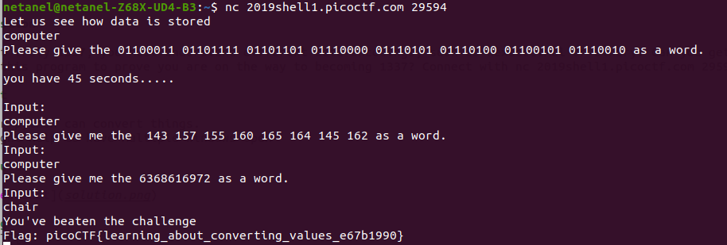

# Based

Points : 200

# Question

To get truly 1337, you must understand different data encodings, such as hexadecimal or binary. Can you get the flag from this program to prove you are on the way to becoming 1337? Connect with nc 2019shell1.picoctf.com 29594.

# Hint 

I hear python can convert things.
It might help to have multiple windows open

# Solution

We need to connect using nc and convert some bases to words ....for this one i choosed to use rapidtables 
https://www.rapidtables.com/convert/number/ascii-hex-bin-dec-converter.html

# Flag
picoCTF{learning_about_converting_values_e67b1990}
