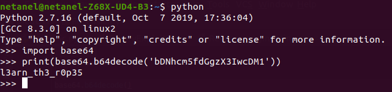

# Bases

Points : 100

# Question
What does this bDNhcm5fdGgzX3IwcDM1 mean? I think it has something to do with bases.

# Hint 
Submit your answer in our competition's flag format. For example, if you answer was 'hello', you would submit 'picoCTF{hello}' as the flag.

# Solution
Only need to covert bases64 to plain text , we can use python :

# Flag
picoCTF{l3arn_th3_r0p35}
