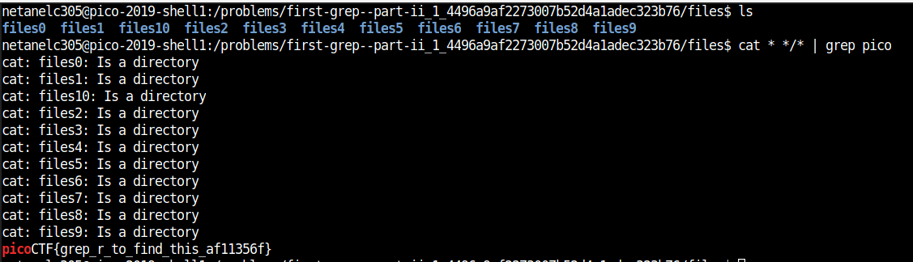

# ChallangeName

Points : 200

# Question

Can you find the flag in /problems/first-grep--part-ii_1_4496a9af2273007b52d4a1adec323b76/files on the shell server? Remember to use grep.

# Hint 

grep tutorial

# Solution

This time we need to find the flag on the CTF server and not locally, also we have to look into different 9 directories 
so best way is to cat all files inside the directories and grep pico 

cat * */* | grep pico

# Flag
picoCTF{grep_r_to_find_this_af11356f}
