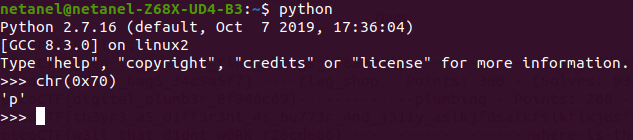

# 2Warm

Points : 50

# Question
If I told you a word started with 0x70 in hexadecimal, what would it start with in ASCII? 

# Hint 
Submit your answer in our competition's flag format. For example, if you answer was 'hello', you would submit 'picoCTF{hello}' as the flag.

# Solution
Only need to covert hex to ascii , we can use python:

# Flag
picoCTF{p}
