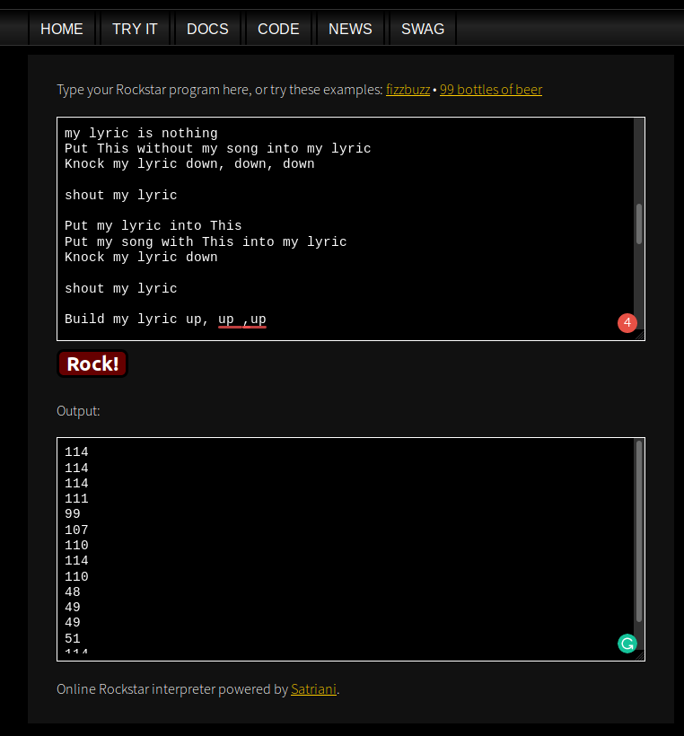
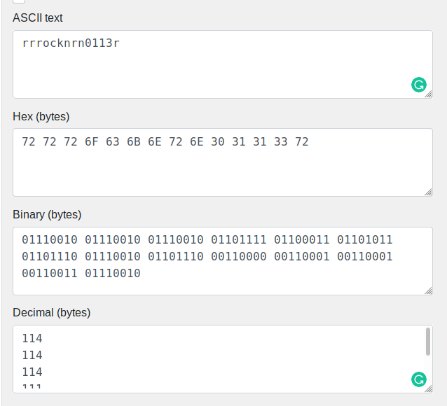

# Mus1c

Points : 300

# Question

I wrote you a song. Put it in the picoCTF{} flag format

# Hint 

Do you think you can master rockstar?

# Solution

I have to admit, in the beginning, I had no idea what where to start from.
after examining the hint I started to look for "rockstar" in related to computers and then I found this https://esolangs.org/wiki/Rockstar
there is a programing language name rockstar! 
after figure this the way to the flag was short, I just put the code here https://codewithrockstar.com/online 
and got some decimal values ...after convert them to ASCII and I got the flag

# Flag
picoCTF{rrrocknrn0113r}

