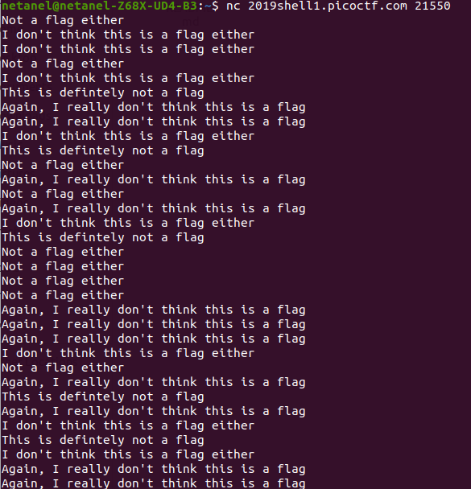
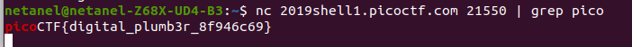

# Plumbing

Points : 200

# Question

Sometimes you need to handle process data outside of a file. Can you find a way to keep the output from this program and search for the flag? Connect to 2019shell1.picoctf.com 21550.

# Hint 

Remember the flag format is picoCTF{XXXX}
What's a pipe? No not that kind of pipe... This kind

# Solution

So we first try to connet the server using nc , how ever we get way too much output 

we can just do it again and pipe it to grep and get the flag

# Flag
picoCTF{digital_plumb3r_8f946c69}
