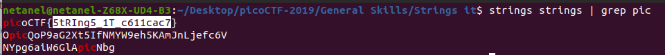

# Strings it

Points : 100

# Question

Can you find the flag in file without running it? You can also find the file in /problems/strings-it_4_e276260a1b64a734b4178a280d25b754 on the shell server.

# Hint 

strings

# Solution
We just need to run strings <fileName> go the the solution ....since there are lot of strings we can use grep to get the flag easier 

# Flag
picoCTF{5tRIng5_1T_c611cac7}
