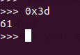

# Warmed Up

Points : 50

# Question
What is 0x3D (base 16) in decimal (base 10).

# Hint 
Submit your answer in our competition's flag format. For example, if you answer was '22', you would submit 'picoCTF{22}' as the flag.

# Solution
Only need to covert bases , we can use python:

# Flag
picoCTF{101010}
