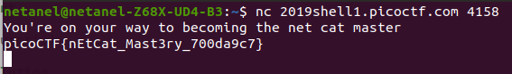

# What's a net cat?

Points : 100

# Question

Using netcat (nc) is going to be pretty important. Can you connect to 2019shell1.picoctf.com at port 4158 to get the flag?

# Hint 

nc tutorial

# Solution
just need to connect using netcat and we get the flag

# Flag
picoCTF{nEtCat_Mast3ry_700da9c7}
