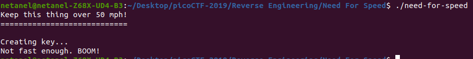
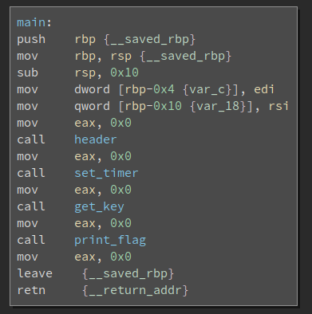
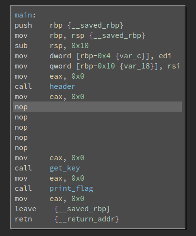
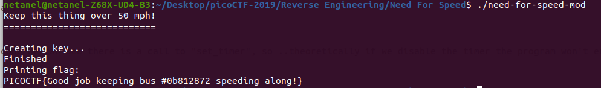

# Need For Speed

Points : 400

# Question

The name of the game is [speed](https://www.youtube.com/watch?v=8piqd2BWeGI). Are you quick enough to solve this problem and keep it above 50 mph? [need-for-speed](need-for-speed).

# Hint 

What is the final key?

# Solution

We getting an executable file and somehow we need to get the key , lets first run it !

so , look like there is a timer that prevent us from getting the flag . 
lets drop it into BinrayNinja .

after checking the assembly code we can see there is a call to "set_timer", so ..theoretically if we disable the timer the program won't end before we get the flag 

 

i converted the call to NOP instruction now lets save it to a new binary file [need-for-speed-mod](need-for-speed-mod) and run it

# Flag
PICOCTF{Good job keeping bus #0b812872 speeding along!}

