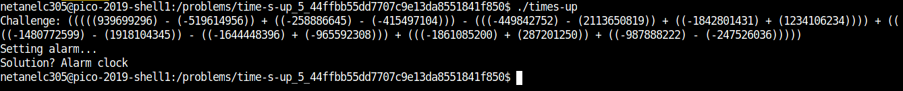
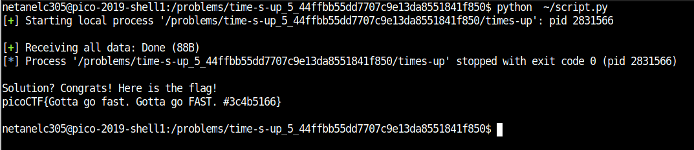

# Time's Up

Points : 400

# Question

Time waits for no one. Can you solve this before time runs out? times-up, located in the directory at /problems/time-s-up_5_44ffbb55dd7707c9e13da8551841f850.

# Hint 

Can you interact with the program using a script?

# Solution

first let run the exectuable and see what we get .




The challenge is a bit similar to [Need for speed](https://github.com/netanelc305/picoCTF-2019/tree/master/Reverse%20Engineering/Need%20For%20Speed)
however this time we can't disable the time because the program need to run on the server, and we need to solve the equation and submit the solution before the time is up

looking at the hint we can try to interact with the program using a script.

```python 
from pwn import *
proc = process('/problems/time-s-up_5_44ffbb55dd7707c9e13da8551841f850/times-up')
res = eval(proc.recvuntil('...').split('\n')[0].split(':')[1])
tmp = proc.recv(0)
proc.sendline(str(res) + '\n')
print tmp
print proc.recvall()
```




# Flag
picoCTF{Gotta go fast. Gotta go FAST. #3c4b5166}

