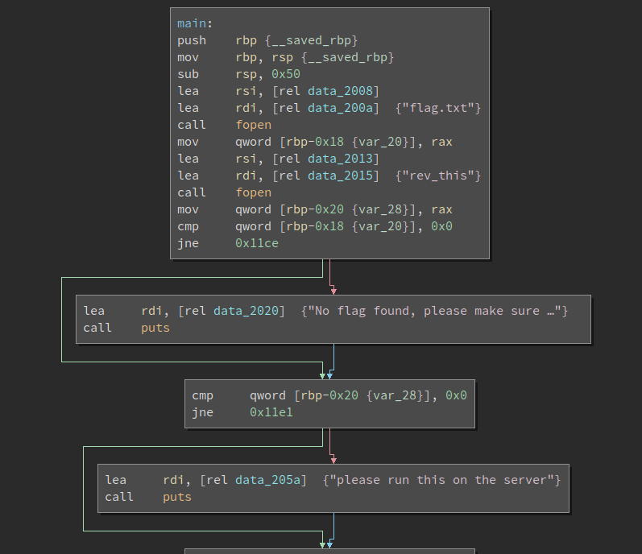
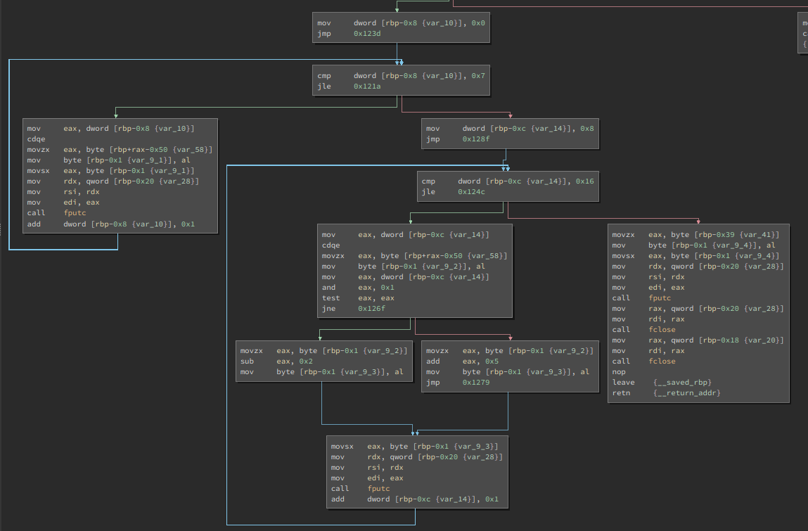

# reverse_cipher

Points : 300

# Question

We have recovered a [binary](rev) and a [text file](rev_this). Can you reverse the flag. Its also found in /problems/reverse-cipher_2_d8dc36eefa9dfce00eac3dab8f42513c on the shell server.

# Hint 

objdump and Gihdra are some tools that could assist with this

# Solution

first i tried to run the binary and an error that flag file did not found , so i decided to open it using BinaryNinja 

first we can see the program try to open file name "flag.txt" and "rev_this".
if "flag.txt" not exsist we recieve an error and program stop .
otherwise , it take the flag from the file and manipulate it as follow :

characters : 0-9 remin with no change .
if char in index < 9 and **even**: Ascii value - 5
else : Ascii value +2 

eventully write the new flag into "rev_this.txt" 

Now .... we recived "rev_this.txt" file , so we have the flag after the program changed it , all we need to do its just to revese it  - [script](script.py)

# Flag
picoCTF{r3v3rs3c3ab1ad1}

