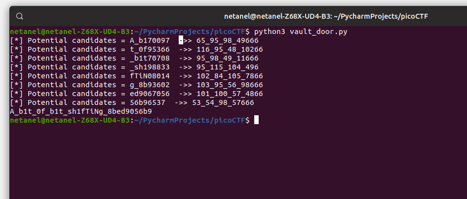

# Vault-door-7

Points : 400

# Question

This vault uses bit shifts to convert a password string into an array of integers. Hurry, agent, we are running out of time to stop Dr. Evil's nefarious plans! The source code for this vault is here: [VaultDoor7.java](VaultDoor7.java)

# Hint 

Use a decimal/hexademical converter such as this one: https://www.mathsisfun.com/binary-decimal-hexadecimal-converter.htmlYou will also need to consult an ASCII table such as this one: https://www.asciitable.com/


# Solution
By examin the source code we can see that : 

```java 
    // Each character can be represented as a byte value using its
    // ASCII encoding. Each byte contains 8 bits, and an int contains
    // 32 bits, so we can "pack" 4 bytes into a single int. Here's an
    // example: if the hex string is "01ab", then those can be
    // represented as the bytes {0x30, 0x31, 0x61, 0x62}. When those
    // bytes are represented as binary, they are:
    //
    // 0x30: 00110000
    // 0x31: 00110001
    // 0x61: 01100001
    // 0x62: 01100010
    //
    // If we put those 4 binary numbers end to end, we end up with 32
    // bits that can be interpreted as an int.
    //
    // 00110000001100010110000101100010 -> 808542562
    //
    // Since 4 chars can be represented as 1 int, the 32 character password can
    // be represented as an array of 8 ints.
    //
    // - Minion #7816
    public int[] passwordToIntArray(String hex) {
        int[] x = new int[8];
        byte[] hexBytes = hex.getBytes();
        for (int i=0; i<8; i++) {               	<----- Like in the description above we take a string and convert it to array of 8 ints
            x[i] = hexBytes[i*4]   << 24
                 | hexBytes[i*4+1] << 16
                 | hexBytes[i*4+2] << 8
                 | hexBytes[i*4+3];
        }
        return x;
    }

    public boolean checkPassword(String password) {
        if (password.length() != 32) {
            return false;
        }
        int[] x = passwordToIntArray(password);      <-------- if we parse the right flag this check suppose to return true 
        return x[0] == 1096770097
            && x[1] == 1952395366
            && x[2] == 1600270708
            && x[3] == 1601398833
            && x[4] == 1716808014
            && x[5] == 1734293602
            && x[6] == 1701067056
            && x[7] == 892756537;
    }
```


In order to find the right flag , we need to find a 8 groups of 4 letters each that will return true when we call to " passwordToIntArray(password)"
i decided to bruteforce the soultion since 94^4 possibilities  is not that bad   - [script](script.py)

```python
def vault_door_7():

    encrypted_flag=[1096770097,1952395366,1600270708,1601398833,1716808014,1734293602,1701067056,892756537]
    flag="picoCTF{"
    for letters in encrypted_flag:
        to_break=False
        for A in range(33, 127):
            if to_break==True:
                break
            for B in range(33, 127):
                if to_break == True:
                    break
                for C in range(33, 127):
                    if to_break == True:
                        break
                    for D in range(33, 127):
                        if to_break == True:
                            break
                        print("[*] Testing letters group {}  ->> {}_{}_{}_{}".format(letters,A,B,C,D),end='\r')
                        if ((A << 24) | (B << 16) | (C << 8) | D) == letters:
                            candidates =chr(A)+chr(B)+chr(C)+chr(D)
                            print("[*] Potential candidates = "+candidates)
                            flag+=candidates
                            to_break=True
                            break

    flag+="}"
    print(flag)
if __name__ == '__main__':
    vault_door_7()
```




# Flag
picoCTF{A_b1t_0f_b1t_sh1fTiNg_8bed9056b9}

